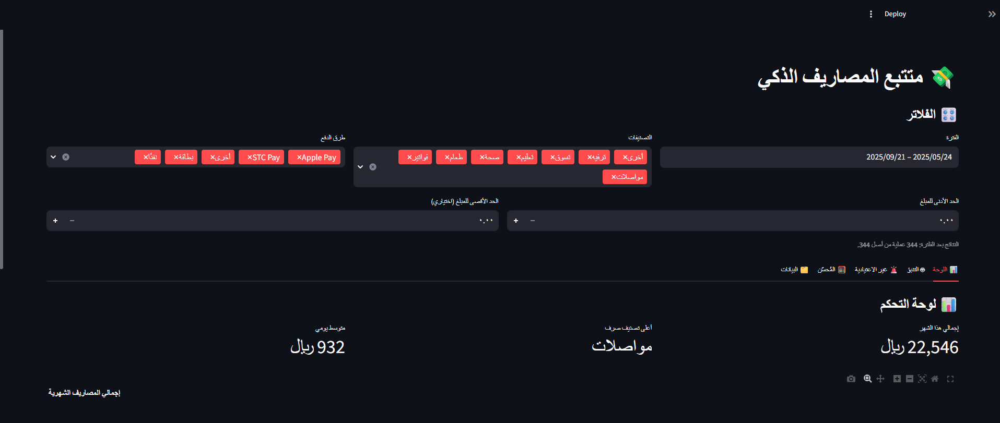
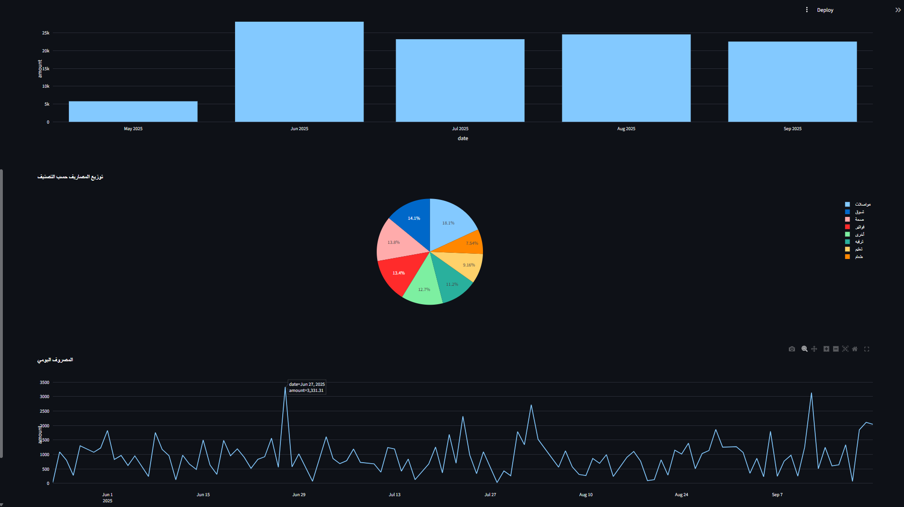
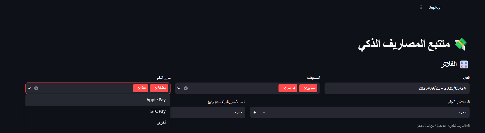
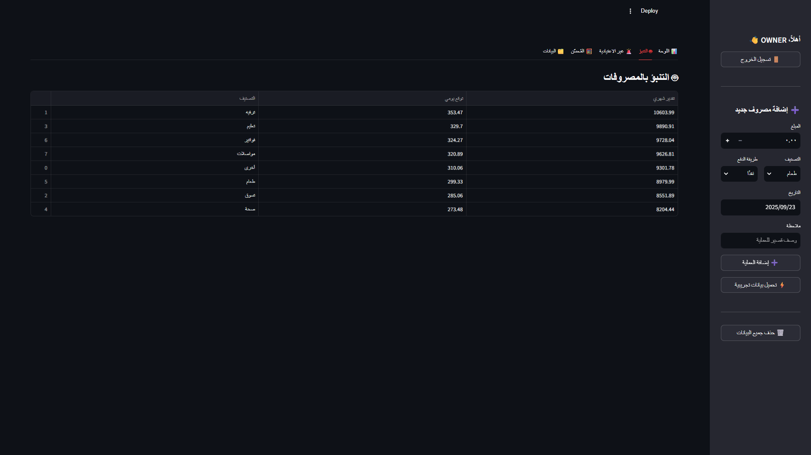
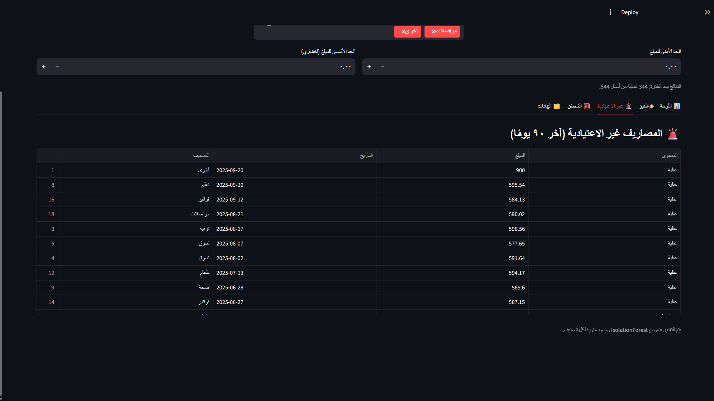
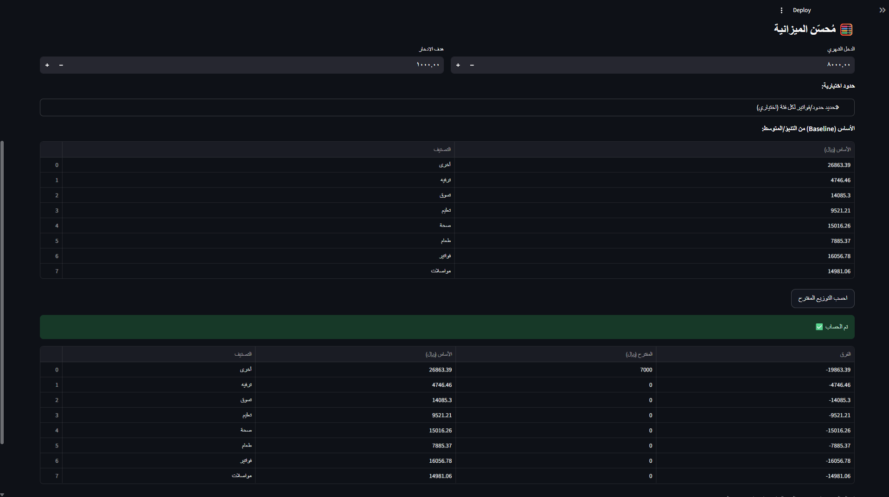
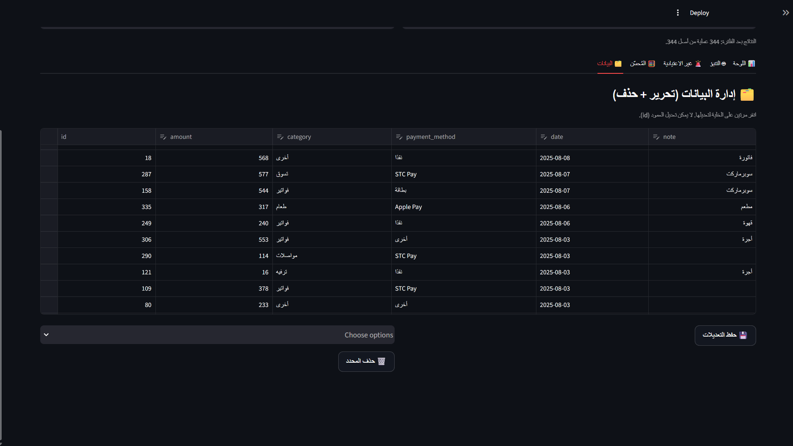

<div dir="rtl" align="right">

# 💸 متتبع المصاريف الذكي (عربي)

تطبيق **Streamlit** لإدارة وتتبع المصاريف بواجهة عربية (RTL) مع:
- 🤖 **تنبؤ شهري للفئات** (تلقائيًا أو متوسط ذكي عند قلّة البيانات)
- 🚨 **كشف المصاريف غير الاعتيادية** (<span dir="ltr"><code>IsolationForest</code></span>)
- 🧮 **مُحسّن الميزانية** بحسب الدخل وهدف الادخار (<span dir="ltr"><code>Linear Programming (PuLP)</code></span>)
- 🎛️ **فلاتر تفاعلية** (الفترة، التصنيفات، طرق الدفع، نطاق المبالغ)
- ✍️ **تحرير مباشر** للبيانات + **حذف فوري**
- ⬇️⬆️ **استيراد/تصدير** <span dir="ltr"><code>CSV</code></span>
- ⚡ زر **تحميل بيانات تجريبية** للاختبار السريع

<p>
  <a href="https://smart-expense-tracker-du7s6hzvunrfdxjemjosam.streamlit.app/">
    
  </a>
</p>

---

## 🚀 جرّبه الآن
- **الديمو المباشر:**  
  <a href="https://smart-expense-tracker-du7s6hzvunrfdxjemjosam.streamlit.app/">smart-expense-tracker…streamlit.app</a>  
- **الكود على GitHub:**  
  <a href="https://github.com/ABDULRHMAN-5ALID/smart-expense-tracker">ABDULRHMAN-5ALID/smart-expense-tracker</a>

> ⚠️ **تنبيه:** التخزين باستخدام <span dir="ltr">SQLite</span> على الاستضافات المجانية قد يكون مؤقّتًا. للإنتاج يُنصح بقاعدة خارجية مثل <span dir="ltr">Supabase / Postgres</span>.

---

## ✨ المزايا بالتفصيل
- 📊 لوحة تحكم تفاعلية مع مؤشرات <span dir="ltr">KPIs</span> ورسوم (شهري/يومي/حسب التصنيف).
- 🤖 تنبؤ للفئات (<span dir="ltr">XGBoost</span> تلقائيًا أو متوسط ذكي عند قلّة البيانات).
- 🚨 كشف غير اعتيادي باستخدام <span dir="ltr"><code>IsolationForest</code></span>.
- 🧮 تحسين الميزانية بـ <span dir="ltr"><code>PuLP</code></span> مع حدود اختيارية لكل فئة.
- ✍️ محرّر بيانات تفاعلي لتحرير/حذف السجلات مباشرة من الواجهة.
- ⬇️⬆️ استيراد/تصدير <span dir="ltr"><code>CSV</code></span> للأعمدة:  
  <span dir="ltr"><code>amount, category, payment_method, date, note?</code></span>
- 🎛️ فلاتر حيّة تؤثر على كل التبويبات.

---

## 🖥️ التشغيل محليًا
```bash
python -m venv .venv
# Windows
.venv\Scripts\activate
# macOS / Linux
source .venv/bin/activate

pip install -r requirements.txt
streamlit run app.py
```

**ملاحظات:**
- تُنشأ قاعدة البيانات تلقائيًا في: <span dir="ltr"><code>data/expenses.db</code></span>  
- لتثبيت الإصدارات الحالية بالضبط:
  ```bash
  pip freeze > requirements.txt
  ```

---

## 📂 بنية المشروع
```text
smart-expense-tracker/
├─ app.py              
├─ db.py                
├─ forecast.py          
├─ anomalies.py        
├─ optimizer.py         
├─ utils.py             
├─ seed_data.py         
├─ data/                
├─ assets/              
└─ .streamlit/          
```

<div dir="rtl">

## لقطات من الواجهة

<p align="center">
  
</p>

<table>
  <tr>
    <td><br><sub>لوحة التحكم</sub></td>
    <td><br><sub>شريط الفلاتر</sub></td>
  </tr>
  <tr>
    <td><br><sub>التنبؤ</sub></td>
    <td><br><sub>غير الاعتيادية</sub></td>
  </tr>
  <tr>
    <td><br><sub>مُحسّن الميزانية</sub></td>
    <td><br><sub>إدارة البيانات</sub></td>
  </tr>
</table>

</div>

---

## 📦 المتطلبات (مختصرة)
```text
streamlit>=1.31
pandas>=2.1
plotly>=5.18
scikit-learn>=1.3
pulp>=2.7
python-dateutil>=2.8
xgboost>=1.7
```

---

## ☁️ النشر على Streamlit Cloud
1. اربط حسابك بـ <span dir="ltr">Streamlit Cloud</span>.  
2. <span dir="ltr">New app</span> → اختر الريبو <span dir="ltr">ABDULRHMAN-5ALID/smart-expense-tracker</span>، فرع <span dir="ltr">main</span>، الملف <span dir="ltr">app.py</span>.  
3. (اختياري) اضبط <span dir="ltr">Python 3.11</span>.  
4. <span dir="ltr">Deploy</span> ثم شارك الرابط.

> للتخزين الدائم، استخدم <span dir="ltr">Supabase/Postgres</span> بدل <span dir="ltr">SQLite</span>.

---

## ⬇️⬆️ الاستيراد/التصدير (CSV)
- **تصدير:** من الشريط الجانبي ← ⬇️ تصدير <span dir="ltr">CSV</span>.  
- **استيراد:** ارفع ملفًا بالأعمدة:  
  <span dir="ltr"><code>amount, category, payment_method, date, note?</code></span>  
  التاريخ بصيغة <span dir="ltr"><code>YYYY-MM-DD</code></span>.

---

## 🗺️ خارطة طريق
- تصنيف تلقائي للمصاريف اعتمادًا على الوصف (NLP).
- تقارير PDF شهرية قابلة للتنزيل.
- دعم عملات متعددة وإعدادات محلية.
- تسجيل دخول (OAuth) وتخزين مستخدمين.
- ربط <span dir="ltr">Supabase/Postgres</span> للتخزين الدائم.

---

## 🤝 المساهمة
مرحبًا بالمساهمات! افتح <span dir="ltr">Issue</span> لأي اقتراح/خطأ، أو أرسل <span dir="ltr">Pull Request</span>.

---

## 📝 الرخصة
**MIT** — انظر ملف <span dir="ltr"><code>LICENSE</code></span>.

</div>
